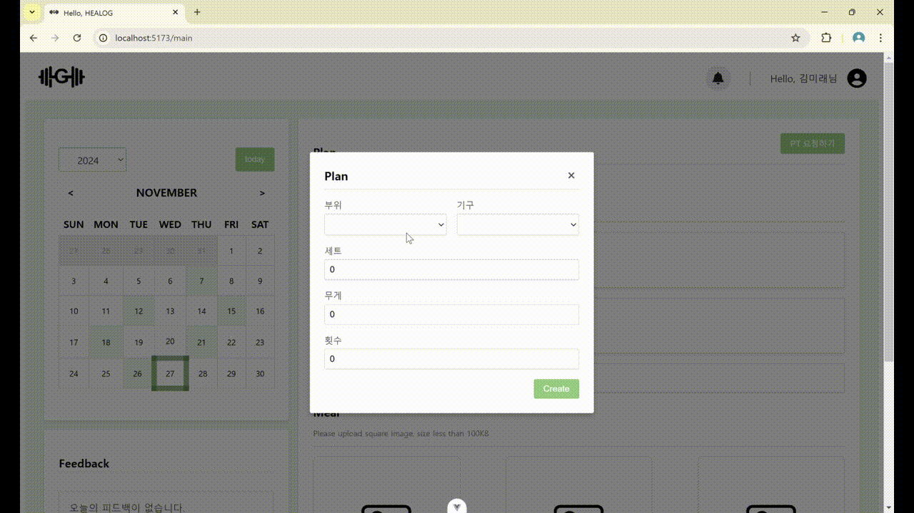
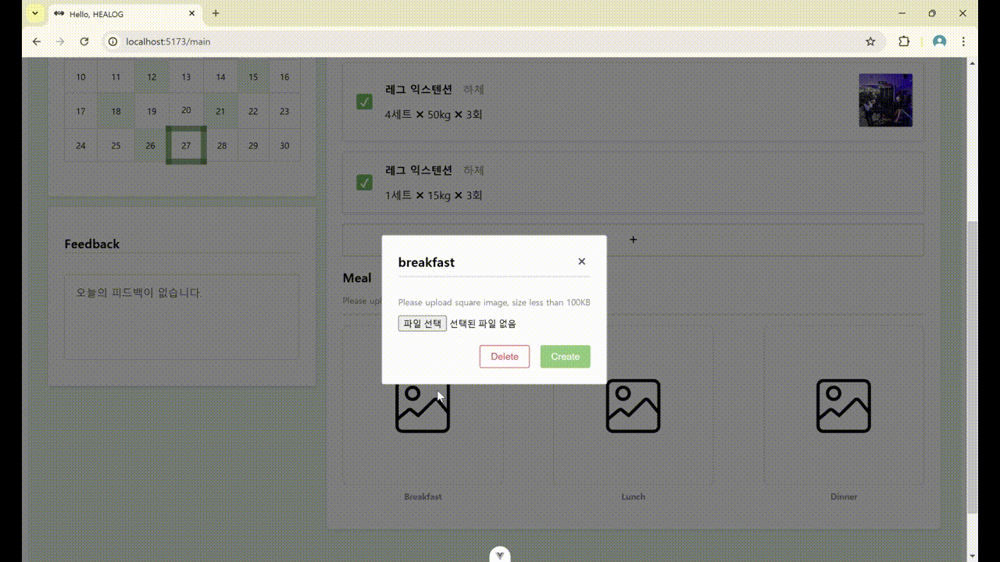
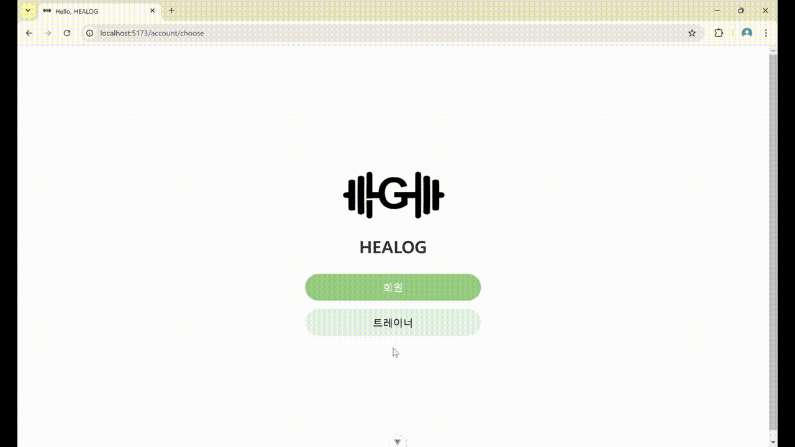
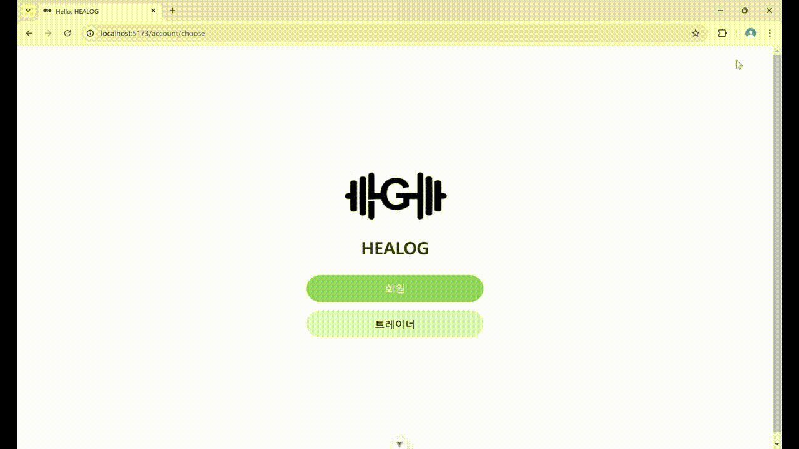
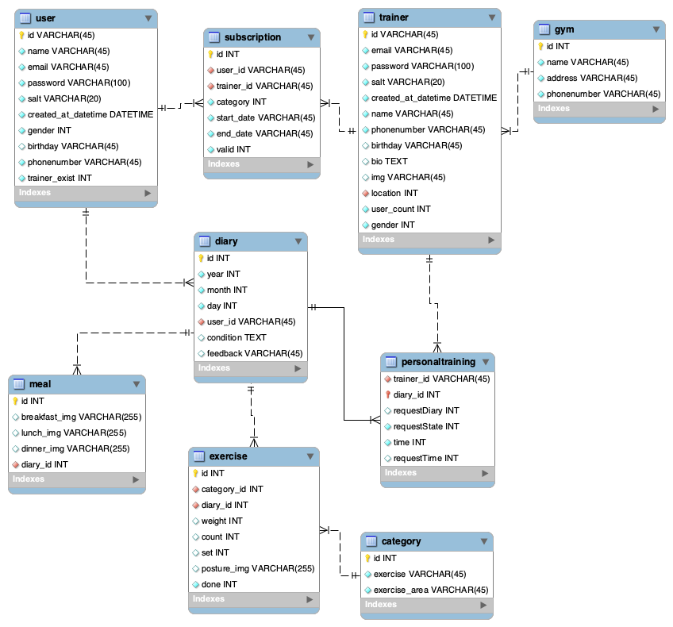
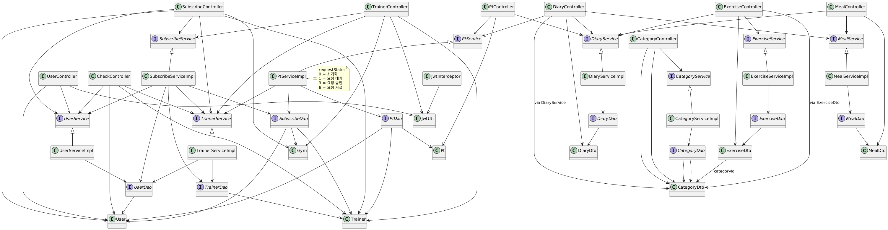

# HEALOG💪
PT 회원-트레이너 매칭 및 운동관리 플랫폼
## 📍프로젝트 개요
PT회원과 트레이너를 연결해주고, 운동 계획, 식단, 컨디션을 체계적으로 관리할 수 있는 헬스케어 플랫폼입니다.

## 📅프로젝트 기간 & 팀원

- 2024년 11월 19일 - 2024년 11월 26일
- 김혜민 (팀장), 신유영 (팀원)

## ⚙기술 스택

## 🛠개발 도구
|도구|버전|설명|
|---|---|---|
|STS|4.23.1|Backend|
|VSCode|1.95.1|Frontend|

## 🔧개발 환경
|환경|버전|설명|
|---|---|---|
|JAVA|17|Backend|
|MySQL|8.0.35|DB|
|mybatis|3.0.3|Backend|
|Vue.js|3.4.21|Frontend|
|Springboot|3.3.5|Backend|

## 🖥기능
### 회원 가입 및 로그인

- **회원 종류 선택** : 사용자는 회원 가입 시 일반 회원과 트레이너 중 하나를 선택할 수 있습니다.
- **회원 가입** : 사용자는 필수 정보를 입력하고 회원 가입을 완료할 수 있습니다.
- **로그인** : 회원 가입을 한 사용자는 이메일과 비밀번호를 사용하여 로그인합니다.
- **로그아웃** : 로그인한 사용자는 로그아웃하여 서비스 이용을 중단할 수 있습니다.
- **비밀번호 재설정** : 비밀번호를 잊은 경우, 이메일을 통해 재설정할 수 있습니다.
- **회원 탈퇴** : 사용자의 정보를 삭제하기 위해 회원 탈퇴를 할 수 있습니다.

### 마이 페이지

- **마이 페이지 이동** : 회원은 마이 페이지로 이동하여 개인 정보를 수정할 수 있습니다.
- **구독 관리** : 마이 페이지에서 트레이너 구독 상태를 확인하고 취소할 수 있습니다.

### 운동 계획 관리

- **운동 계획 등록** : 회원은 운동할 부위, 횟수, 세트, 무게 등을 설정하여 운동 계획을 등록할 수 있습니다.
- **운동 계획 수정/삭제** : 기존의 운동 계획을 수정하거나 삭제할 수 있습니다.
- **운동 완료 등록** : 운동 계획이 완료되었을 때 완료 상태로 표시할 수 있습니다.

### 식단 관리

- **식단 사진 등록** : 회원은 하루 세 끼(아침, 점심, 저녁)의 식단 사진을 등록할 수 있습니다.
- **식단 사진 삭제** : 회원은 잘못 등록한 식단 사진을 삭제할 수 있습니다.

### 컨디션 관리

- **컨디션 상태 등록** : 회원은 컨디션 상태를 기록할 수 있습니다.

### 트레이너 구독

- **트레이너 구독** : 원하는 트레이너를 찾아 구독할 수 있습니다.
- **구독 취소** : 더 이상 필요하지 않으면 구독을 취소할 수 있습니다.

### PT 일정 관리

- **PT 일정 조회** : 회원은 트레이너가 등록한 PT 일정을 확인할 수 있습니다.
- **PT 일정 수정 요청** : 예약된 PT 일정 변경이 필요한 경우 트레이너에게 일정을 변경하도록 요청할 수 있습니다.
- **PT 일정 승인/거절 알림**: 트레이너가 일정 변경 요청을 승인하거나 거절할 때 알림을 받을 수 있습니다

### 회원 가입 및 로그인

- **회원 가입** : 트레이너는 별도의 회원 가입 양식을 통해 가입할 수 있습니다.
- **로그인** : 회원 가입을 한 사용자는 이메일과 비밀번호를 사용하여 로그인합니다.
- **로그아웃** : 로그인한 사용자는 로그아웃하여 서비스 이용을 중단할 수 있습니다.
- **비밀번호 재설정** : 비밀번호를 잊은 경우, 이메일을 통해 재설정할 수 있습니다.
- **회원 탈퇴** : 사용자의 정보를 삭제하기 위해 회원 탈퇴를 할 수 있습니다.

### 마이 페이지 접근

- **마이 페이지 이동** : 트레이너는 마이 페이지에서 자신의 정보를 조회하고 수정할 수 있습니다.

### 구독 회원 관리

- **구독 회원 조회** : 자신을 구독 중인 회원 목록을 확인할 수 있습니다.
- **구독 회원 관리** : 특정 회원의 운동 계획을 확인할 수 있습니다.

### PT 일정 관리

- **PT 일정 등록** : 회원과의 PT 일정을 등록할 수 있습니다.
- **PT 일정 수정/삭제** : 등록된 PT 일정을 수정하거나 삭제할 수 있습니다.

### 운동 추천

- **운동 추천 등록** : 트레이너는 회원에게 추천하는 운동을 등록할 수 있습니다.
- **운동 추천 수정/삭제** : 추천한 운동을 수정하거나 삭제할 수 있습니다.

### 피드백 관리

- **운동 계획 피드백 작성** : 회원의 운동 기록에 대해 피드백을 남길 수 있습니다.
- **피드백 수정/삭제** : 이전에 남긴 피드백을 수정하거나 삭제할 수 있습니다.

### 실시간 알림

- **PT 일정 승인/거절 알림** : 트레이너가 PT 일정 변경 요청을 승인하거나 거절할 때 회원에게 알림을 보냅니다.
- **운동 계획 완료 알림** : 회원이 운동 계획을 완료하면 트레이너에게 알림이 발송됩니다.
- **피드백 등록 알림** : 트레이너가 회원의 운동 계획에 피드백을 남기면 회원에게 알림이 발송됩니다.

## 🗂페이지 소개

### 메인 페이지
- 컨디션 상태 등록
- 운동 계획 등록
- 식단 사진 등록

### 회원가입 및 로그인
- 트레이너 회원가입 및 로그인
- 회원 회원가입 및 로그인

### 마이 페이지
- 트레이너 구독
- PT 알림

## 📋ERD

## 📋클래스 다이어그램

## 느낀점
### 신유영
이 프로젝트를 통해 얻은 경험은 여러 면에서 큰 도움이 되었습니다. 특히, 처음으로 커밋 컨벤션 규칙을 정하고 API 명세서를 작성하며, 유스 케이스 정리, Figma를 통한 UI 프로토타입 설계, 간트차트 작성 등 체계적인 개발 과정을 경험할 수 있었습니다. 이는 실제 현업에서 중요하게 다루는 부분이며, 프로젝트 관리를 전반적으로 이해하는 데 큰 밑거름이 되었습니다.

특히, 메인 화면에 필요한 기능을 주로 담당하면서, JSON과 MultipartFile을 동시에 처리하는 과정에서 백엔드와 프론트엔드 간의 데이터 통신 문제를 겪었습니다. 많은 어려움이 있었지만, 파일 저장 경로와 반환 경로를 따로 관리하는 방식으로 성공적으로 해결할 수 있었습니다. 

또한, Exercise 관련 로직을 처리하면서 카테고리 드롭다운 기능을 추가하여 사용자가 쉽게 운동 계획을 관리할 수 있도록 하는 데 초점을 맞췄습니다. 

전반적인 CSS 작업을 도맡아 사용자에게 직관적이고 보기 좋은 인터페이스를 제공하기 위해 노력했습니다. 디자인 작업은 사용자 편의성을 고려해야 하기 때문에 Figma 프로토타입과 연계해 CSS를 작성했습니다.

결론적으로, 이번 프로젝트에서 다양한 기술과 툴을 다루면서 개발의 모든 과정을 경험하고 이를 성공적으로 수행한 것이 매우 뿌듯했습니다. 각각의 과제에서 어려움을 겪고 그것을 해결해 나간 경험은 앞으로 개발자로서 성장하는 데 큰 도움이 될 것이라고 생각합니다.

### 김혜민
#### 깊게 고민했던 부분
* UUID, 해시암호화, jwt, router될 때도 로그인 여부 확인하기 회원들의 보안에 대해 고민을 많이했다.
* user와 trainer의 구독 기능을 구현할 때 기간이 지났을 때 구독을 비활성화하게 하는 로직을 만드는데 노력했다.
* user와 trainer view가 약간씩 다른데, 어떻게 하면 효율적으로 관리할 수 있을지. 컴포넌트화하는게 중요하다는 걸 알게되었다. 시간이 촉박하지 않았다면 더 깔끔한 코드를 쓸 수 있었을 것 같다는 아쉬움이 있다.
* 라이브러리를 사용하지 않고 자바스크립트로 달력 알고리즘을 직접 만들어보았다. 그리고 pt가 있는 날과 선택된 날을 표시하는 로직을 스스로 생각해낸게 뿌듯했다.
* pt에 대한 요청을 주고받는 것에 대해서 로직을 고민을 많이했다. 3씩 띄워서 동일하게 처리하도록 한게 참 잘한일 인 것 같다.
* 생각보다 신경써야 할 디테일들이 정말 많았다. 하나의 모달을 수정, 삭제, 생성 등에서 같이 쓰려면 props를 어떻게 활용해야하는 지에 대해 고민을 많이 해보았다.
* vue의 생명 주기와 비동기 함수에 대한 이해가 늦게 되어서 꽤나 고생했다. 앞으론 더 잘해야지.

#### 나의 마음 + 아쉬운 점
* 더이상 git conflict이 무섭지 않아졌다.(사실 조금 무섭다)
* 기능별로 나눠서 구현을 했기때문에 협업을 하는데 있어서 크게 어렵지 않았다. 그런데 API 명세서가 끊임없이 수정되는 걸 느끼고 정말 처음부터 탄탄히 쌓아가여 front와 back이 나뉘었을때 문제가 발생하지 않을 것 같다.
* api를 적용해보고 싶었는데, 시간이 마땅하지 않았다는 점이 아쉽다. 지도, 결제, ai api를 활용해보고 싶다.
* 템포를 조절해야한다. 하고싶은게 생기면 앞뒤안가리고 너무 달려드려고 하는 나의 모습을 보고 이러면 오래가지 못할 것이라는 생각이 들었다.
* 프론트 처음에 시작할 때 파일 구조가 얼마나 중요한지, store를 어떻게 사용해야 좋은지를 고민을 안하고 시작해서 갈수록 감당할 수 없어졌다. 다음 프로젝트부터는 꼭 차분하게 구조 잘 잡아가면서 해야겠다.